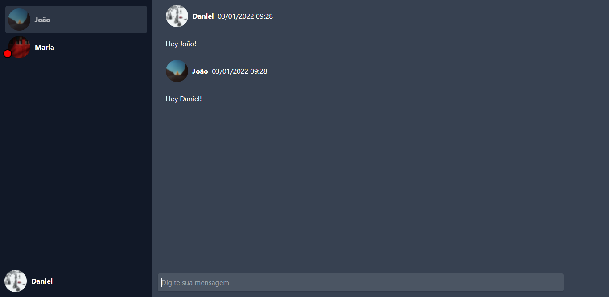

# Chat Websocket - Chat developed using Nodejs with Express and Socket.io

This project was developed during the NodeJS track, available on Rocketseat's Ignite.

## Table of contents

- [Overview](#overview)
  - [The project](#the-project)
  - [Screenshot](#screenshot)
- [Development process](#development-process)
  - [Built with](#built-with)
- [Coded by](#coded-by)
- [How to run the project](#how-to-run-the-project)

## Overview

### The project

Users should be able to:

- View list of active users
- Start a chat conversation
- Update messages in real time
- Receive notification of new messages

### Screenshot

## Development process

### Built with

- Express
- Socket.io
- Mongoose
- NodeJS
- MongoDB

## Coded by

- Website - [Daniel Mafra](https://danielmafra.github.io)
- LinkedIn - [@danielmafradev](https://linkedin.com/in/danielmafradev)
- Instagram - [@danielmafradev](https://instagram.com/danielmafradev)

## How to run the project

Clone the repository using "git clone". After that, go to the project folder and use the command "npm install" or "yarn install" to install the dependencies.

Make sure you are running MongoDB and adjust the src/http.ts and src/server.ts file settings according to your needs.

Finally use the command "npm run dev" or "yarn dev" to start the project.
